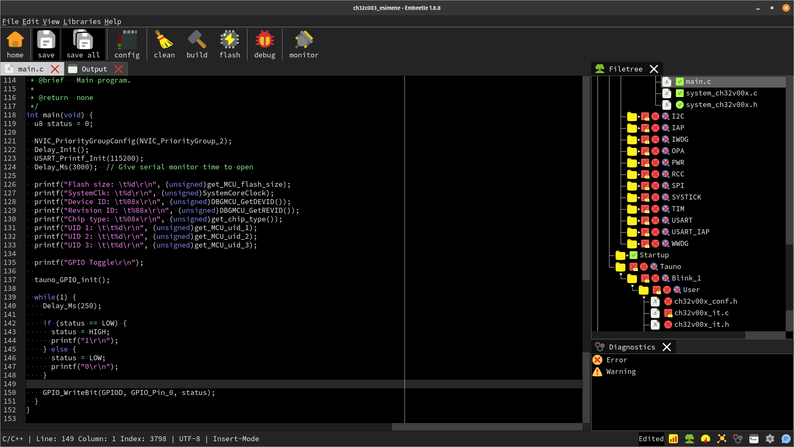

# CH32V003 Experiments

My experiments with learning and programming CH32V003 microcontroller with a Embeetle IDE.

* https://taunoerik.art/2024/07/15/ch32v003-gpio-pin-modes/
* https://taunoerik.art/2023/08/05/programming-ch32v003/
* https://taunoerik.art/2023/07/16/development-board/
* https://taunoerik.art/2023/10/22/ch32v003f4p6-board/
* https://taunoerik.art/2024/07/13/ch32v003-analog-reading/

______
Tauno Erik 15.07.2024
